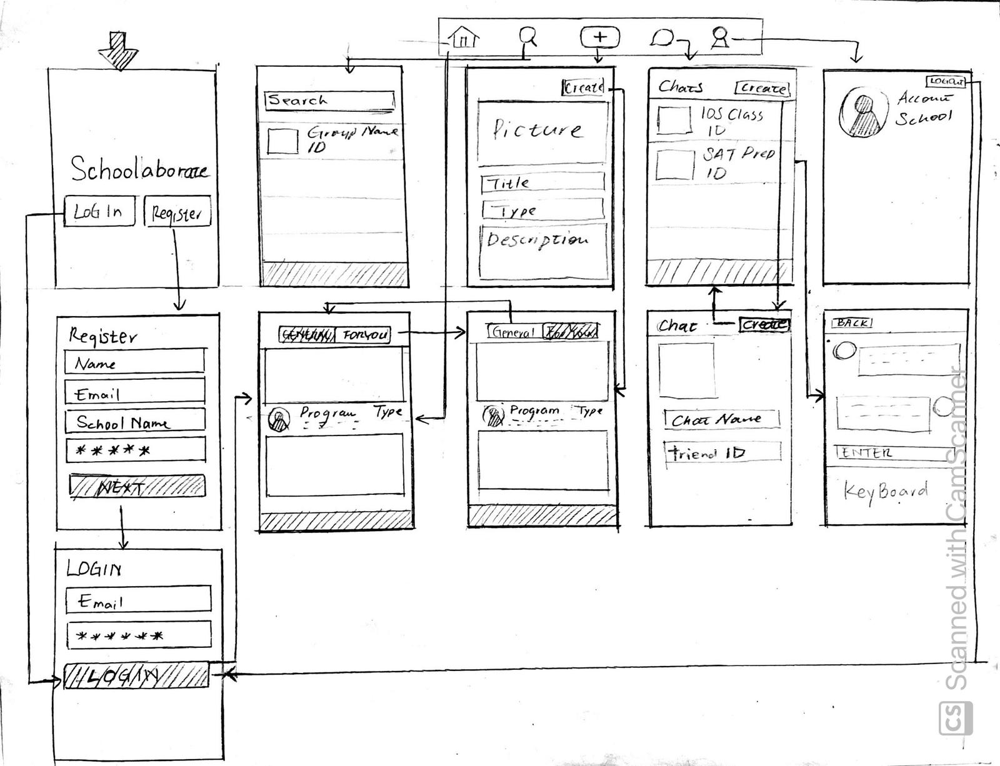
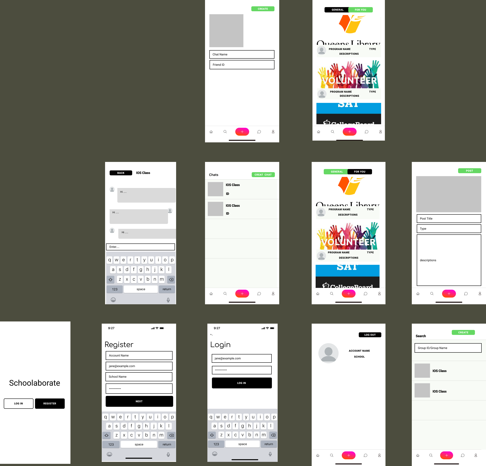

Original App Design Project
===

# Schoolaborate

## Table of Contents
1. [Overview](#Overview)
1. [Product Spec](#Product-Spec)
1. [Wireframes](#Wireframes)
2. [Schema](#Schema)

## Overview
### Description
An application for the community of high school student. They could share the volunteer opportunities, scholar programs, SAT studying groups, or anything benefit with their college applications. This application could also work with the community houses, colleges, or like SYEP programs. It also provides features like to-do list. 

Students can share their notes on a class, add homework to a schedule, and upload study guides for upcoming exams.

### App Evaluation
[Evaluation of your app across the following attributes]
- **Category:** Social Networking, Education
- **Mobile:** This app would be primarily developed for mobile.
- **Story:** Students pick their currently enrolled school during the sign up process. This will match them with other students in their school where opportunities, scholar programs, study groups, and college application help show up on a bulletin. Students can create subgroups where they can invite other students to share materials from their classes (notes, class schedule, and study guides)
- **Market:** Any Student who want to expand their networking and gain opportunities
- **Habit:** This app could be used as often or unoften as the user wanted depending on how investing they are in their education.
- **Scope:** Could expand to other education levels (College, MBA etc.)

## Product Spec

### 1. User Stories (Required and Optional)

**Required Must-have Stories**

* Register
* Login
* General Home view - Bulletin view (Feels similar to Discord x Reddit)
* School Specific Home View
* Create group chats
* Create posts

**Optional Nice-to-have Stories**

* Settings to change schools/ education level
* Filter/ Search for content in the Home Views

### 2. Screen Archetypes

* [Login]
* [Register]
   * User signs up or logs into their account
   * User put their information (such as schools, email, age) to register the account
* [Explore]
   * [General view]
       * User can see the recent posts from all the users
       * Allows to create posts including fill in the information and pictures
       *  Allows to tab likes button and send comments
    
   * [School view]
       * User can see the recent posts from his or her school
       * Allows to create posts including fill in the information and pictures
       * Allows to tab likes button and send comments
     
* [Group chats View]
   * Creates group chat
   * Allows to send messages 

### 3. Navigation

**Tab Navigation** (Tab to Screen)

* [Explore / Search tab]
    * [General]
    * [School]
* [Create post]
    * User can upload PDF's, text, images to either the General or school specific home screen.
* [Inbox/ Group Chat]
* [My profile]
    * Settings can be found here
    * Profile image bubble with their year (and or major) and a short bio about themselves.

**Flow Navigation** (Screen to Screen)

* [Register to Login In]
* [Login In to Screens]
   * [Explore Home]
   * [Create]
   * [Inbox/Group Chat]
   * [Profile]
* Explore to Views
    * Explore to General view
    * Explore to School view
    * General to School view

## Wireframes

### [BONUS] Digital Wireframes & Mockups

